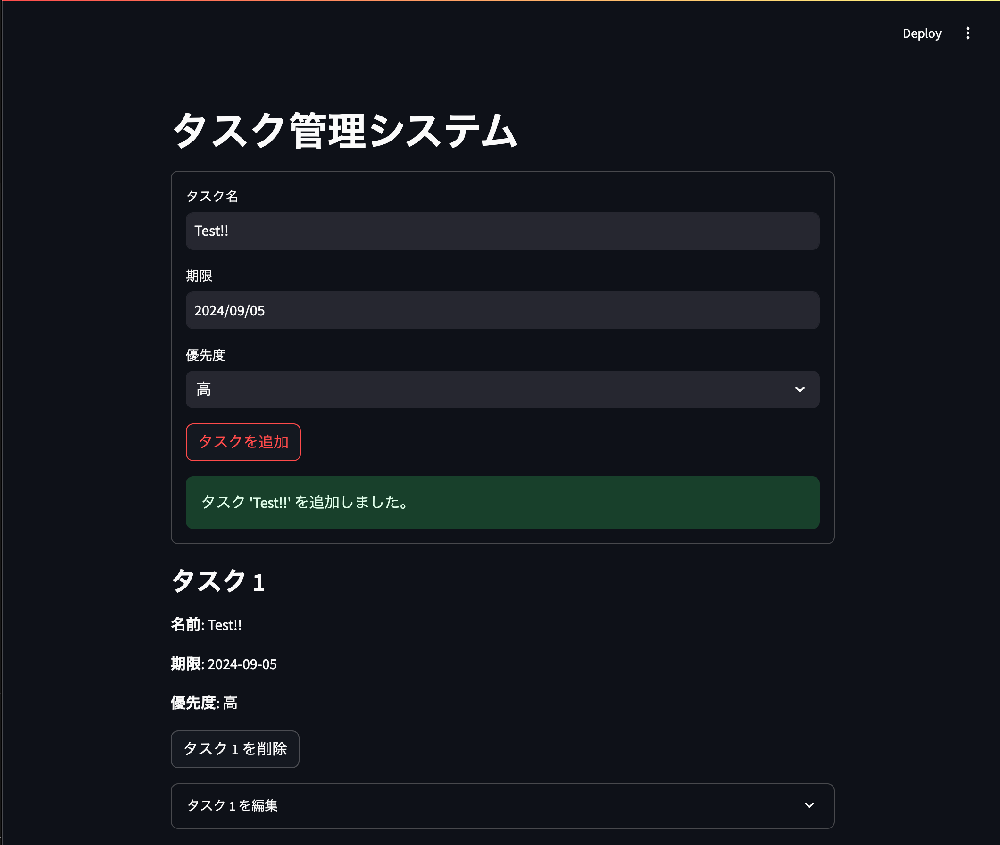

# Ghost AI Compiler

Ghost AI Compilerは、指示文から仕様書を生成し、モジュールの実装までを自動化するツールです。

## インストール

以下のコマンドを実行して依存関係をインストールします。

```bash
poetry install
```

## 使い方

1. `main.py`を実行して、指示文から仕様書を生成し、モジュールの実装を行います。

```bash
poetry run python ghost_ai_compiler/main.py
```

2. `main.py`内の`instructions`リストに指示文を追加します。指示文にはプロジェクトの概要やURLを含めることができます。

```python:ghost_ai_compiler/main.py
    instructions = [
        """Hackers NewsのAPIを使用して、Hacker Newsのトップストーリーを取得するアプリ
APIの仕様は以下を確認してください。
https://github.com/HackerNews/API
        """,
        # "ToDo リストアプリ: タスクの追加、編集、削除、期限や優先度の設定ができるアプリ",
        # "計算機アプリ: 四則演算、平方根、括弧を使った計算と計算履歴の表示ができるアプリ。",
        # "タイマー・ストップウォッチアプリ: カウントダウンタイマーとストップウォッチ機能を持ち、複数のタイマーを同時に設定できるアプリ",
        # "簡単な描画アプリ: キャンバス上で線や図形を描画し、色や線の太さを変更できるアプリ",
        # "ルーレット・ランダムチョイスアプリ: 選択肢を入力し、ランダムに1つを選び、重みづけもできるアプリ",
        # "テキストエディタアプリ: シンプルなテキストの入力、編集、保存、読み込みができるアプリ",
        # "家計簿アプリ: 収入と支出を記録し、カテゴリ別に分類して集計できるアプリ",
        #  "カレンダーアプリ: 予定の追加、編集、削除ができ、日・週・月表示を切り替えられるアプリ",
        # "タッチタイピングアプリ: キーボードのキー入力練習ができ、速度と正確性を測定できるアプリ",
        # "ポモドーロタイマーアプリ: 作業と休憩時間を交互に設定し、集中力を維持するためのアプリ",
        # "シンプルな画像編集アプリ: 明るさ、コントラスト、彩度の調整や、画像の回転、トリミングができるアプリ",
        # "食事記録アプリ: 食事内容を記録し、カロリーや栄養素を計算できるアプリ",
        # "フラッシュカードアプリ: 問題と答えのカードを作成し、暗記学習ができるアプリ",
        # "シンプルな音声録音アプリ: 音声の録音、再生、保存ができるアプリ",
        # "パスワード生成アプリ: 指定した条件に基づいて、安全なパスワードを生成できるアプリ",
        # "単位変換アプリ: 長さ、重さ、温度など様々な単位を変換できるアプリ",
        # "マインドマップアプリ: アイデアを整理し、視覚的に表現できるアプリ",
        # "シンプルな家族向けチャットアプリ: テキストメッセージの送受信ができる家族向けのアプリ",
        # "瞑想アプリ: 瞑想のガイドや、リラックスできる音楽を提供するアプリ"
    ]
```

3. 実行後、`workdir`ディレクトリ内にプロジェクトのドキュメントやソースコードが生成されます。

## ディレクトリ構成

- `ghost_ai_compiler/`
  - `main.py`: メインの実行スクリプト
  - `util.py`: ユーティリティ関数
  - `prompt/`: プロンプトテンプレート
- `workdir/`: 生成されたプロジェクトのドキュメントやソースコード

## プロンプトテンプレート

プロンプトテンプレートは以下のファイルに保存されています。

```plaintext
ghost_ai_compiler/prompt/generate_specification_system.txt
ghost_ai_compiler/prompt/generate_specification_human.txt
ghost_ai_compiler/prompt/generate_module_spec_system.txt
ghost_ai_compiler/prompt/generate_module_spec_human.txt
ghost_ai_compiler/prompt/impl_module_spec_system.txt
ghost_ai_compiler/prompt/impl_module_spec_human.txt
```

## 処理の流れ


1. 指示文のリストを定義します。各指示文は生成するアプリケーションの仕様を記述しています。
2. 各指示文に対して以下の処理を行います。
    1. `workdir`ディレクトリを作成します。
    2. 指示文を出力します。
    3. `generate_specification`関数を呼び出して、指示文から仕様書を生成します。
    4. 生成された仕様書のプロジェクト名を出力します。
    5. 仕様書に含まれる各モジュールに対して以下の処理を行います。
        1. `generate_module_spec`関数を呼び出して、モジュールの仕様書を生成します。
        2. 生成されたモジュールの仕様書の名前を出力します。
        3. `impl_module_spec`関数を呼び出して、モジュールの実装を行います。
        4. モジュールの実装が完了したことを出力します。
    6. 最後に、生成されたプロジェクトのUIをStreamlitで実行するコマンドを出力します。
3. 例外が発生した場合は、その例外を出力します。

## 作成されたアプリケーションサンプル

[デモ](https://src-snowy-thunder-7195.fly.dev/)


